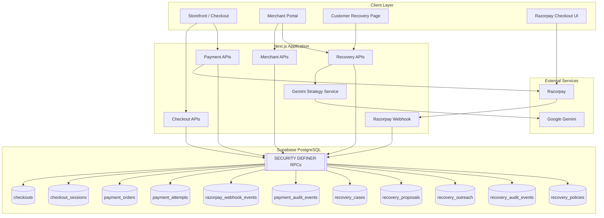
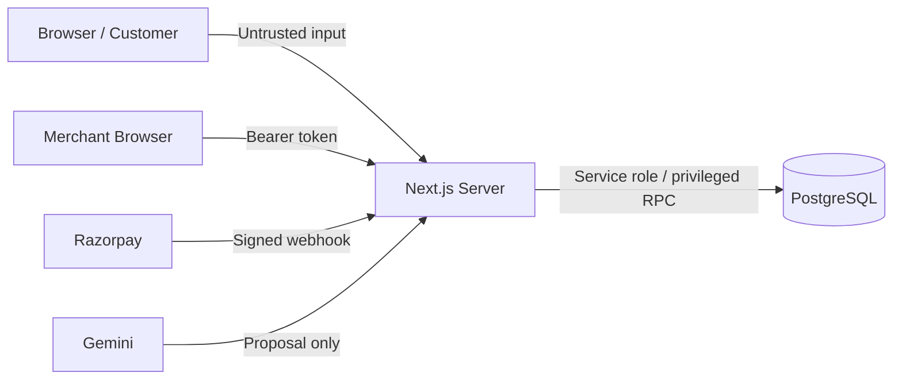
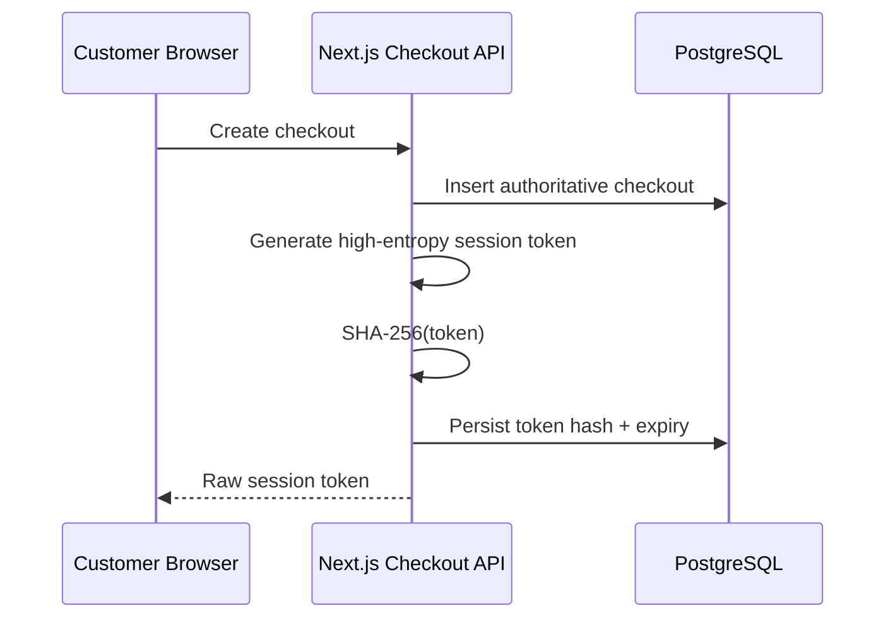
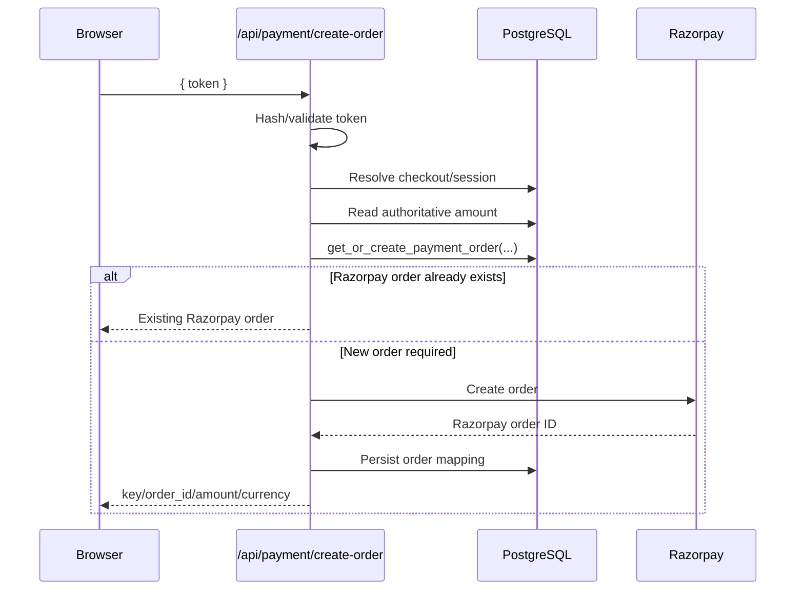
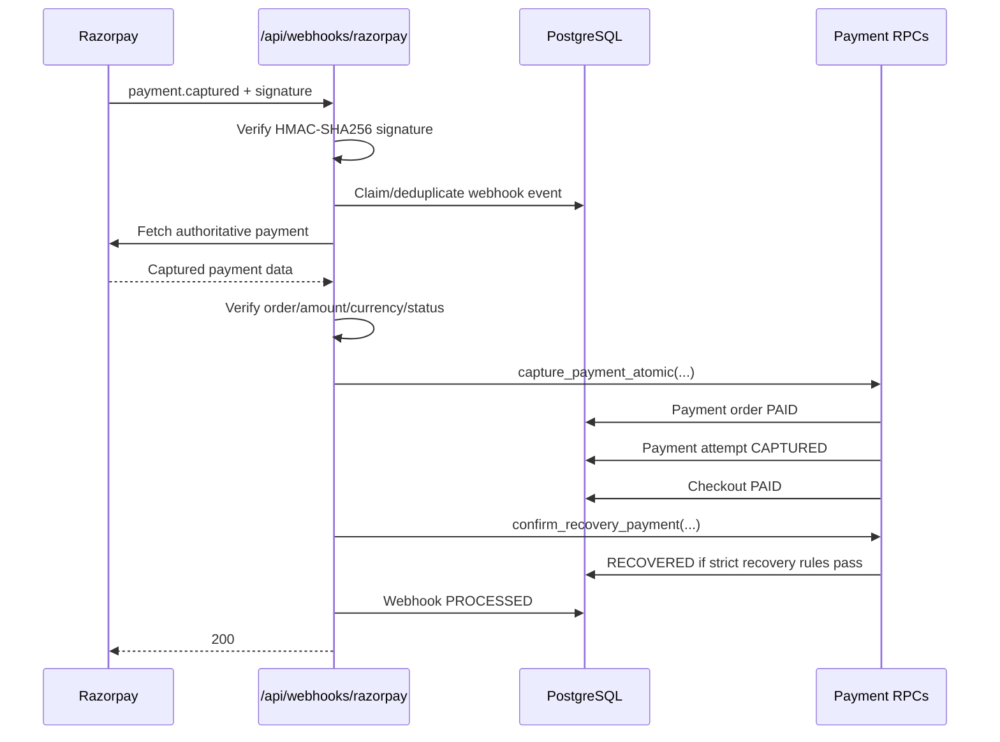
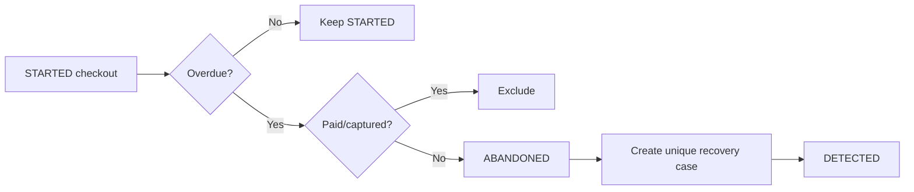
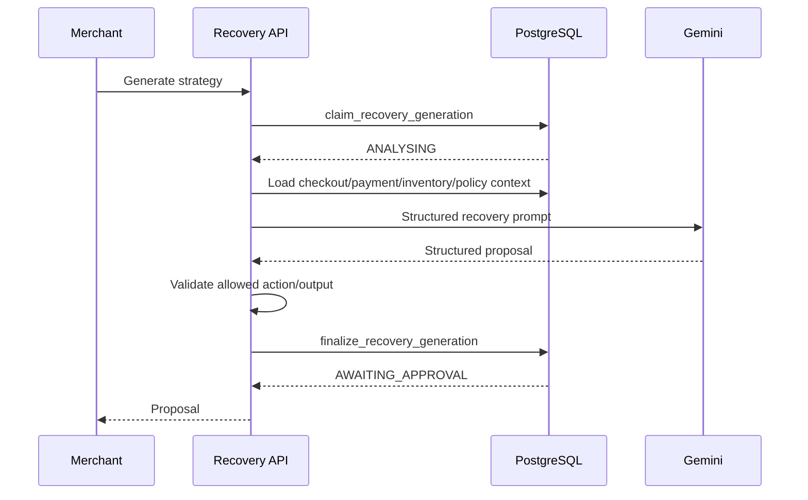
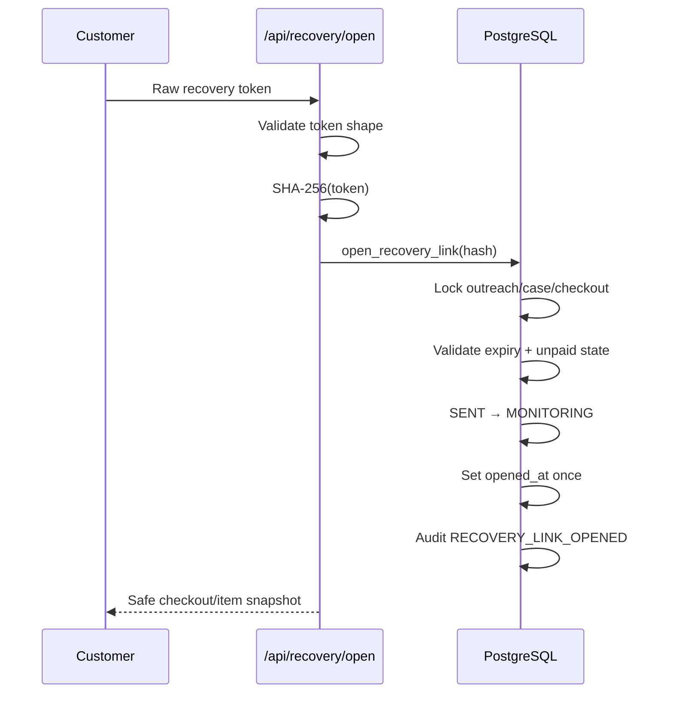
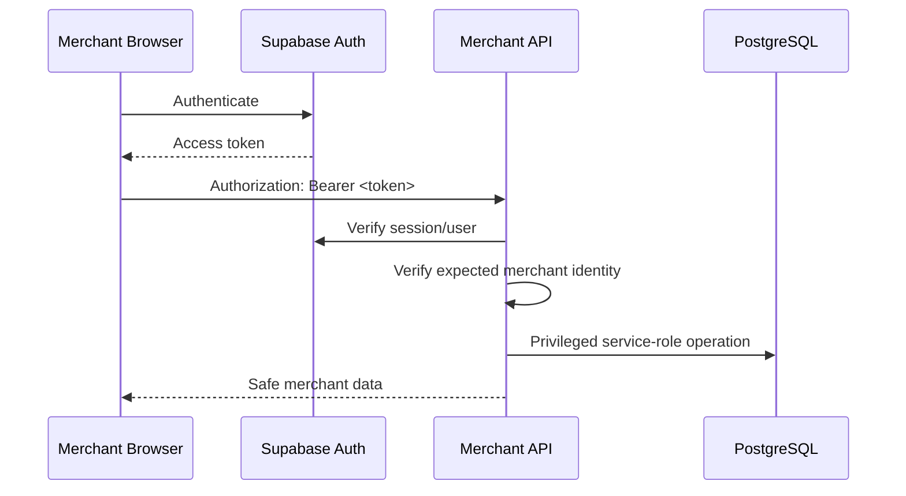

# RecoverCart AI — Architecture

## 1. Architecture Overview

RecoverCart AI is implemented as a **modular monolith** using Next.js App Router for the frontend and server API surface, Supabase/PostgreSQL for persistence and transactional state transitions, Razorpay for payment processing, and Google Gemini for recovery strategy generation.

The architecture intentionally separates four responsibilities:

1. **Commerce state** — checkout/session data.
2. **Payment authority** — Razorpay + server-side verification.
3. **Recovery orchestration** — recovery cases, proposals, outreach, attribution.
4. **Presentation** — merchant dashboard/case workflow and customer recovery UI.

The most important architectural invariant is:

> **Payment state is authoritative only when established by trusted server-side evidence. Gemini and the browser never determine payment success.**

---

## 2. High-Level System Diagram



---

## 3. Architectural Style

### 3.1 Modular monolith

The system is intentionally not split into microservices.

Why:
- buildathon/MVP scope,
- single deployment unit,
- easier local development,
- lower operational complexity,
- transaction-heavy checkout/payment/recovery logic benefits from close coordination,
- Next.js API routes provide enough service boundaries for the current scale.

Logical modules still remain separated by domain:

```text
Checkout
Payment
Webhook
Recovery
AI Strategy
Merchant UI
Customer Recovery UI
Metrics
```

---

## 4. Trust Boundaries



### Trusted
- server-side Next.js execution,
- verified merchant Supabase session,
- verified Razorpay webhook/payment data,
- PostgreSQL authoritative state.

### Untrusted
- browser payment callback,
- browser-supplied amount,
- browser-supplied payment state,
- raw customer recovery token before validation,
- AI-generated payment/payment-status conclusions.

---

## 5. Checkout Architecture

### 5.1 Checkout creation

The checkout flow creates:
- an authoritative `checkouts` row,
- a secure checkout session,
- a hashed session token in `checkout_sessions`.



### Security properties
- raw token not stored,
- checkout amount is server-authoritative,
- server resolves checkout through token/session mapping,
- browser cannot establish payment success.

---

## 6. Payment Architecture

### 6.1 Payment purposes

Payment orders support at least:

```text
INITIAL
RECOVERY
```

This distinction is critical for attribution.

A successful `INITIAL` order can complete checkout, but it must not automatically count as RecoverCart-recovered revenue.

A verified `RECOVERY` payment is eligible for strict recovery attribution.

---

### 6.2 Initial payment order creation



### Idempotency
The database controls logical order creation through deterministic idempotency keys.

This protects against:
- retries,
- double clicks,
- repeated checkout openings,
- temporary failures during external order creation.

---

## 7. Razorpay Webhook Architecture

The webhook is the core payment authority.



### Supported payment event classes
Current flow handles:
- `payment.captured`
- `payment.failed`

---

## 8. Webhook Idempotency

`razorpay_webhook_events` protects against duplicate delivery.

Conceptual lifecycle:

```text
PENDING
  ↓
PROCESSING
  ├──→ PROCESSED
  └──→ FAILED
```

A webhook retry should not create:
- duplicate payment attempts,
- duplicate recovery attribution,
- duplicate checkout transitions.

---

## 9. Payment-Wins Rule

One important invariant is:

> A verified successful payment has priority over abandonment/recovery state.

For example:

```text
checkout ABANDONED
+
valid payment capture arrives
→ checkout PAID
```

The checkout does not remain abandoned merely because the recovery workflow started earlier.

---

## 10. Recovery Detection Architecture

### 10.1 Abandonment scan

The server invokes:

```text
scan_and_abandon_checkouts(...)
```

The operation:
1. finds overdue unpaid `STARTED` checkouts,
2. excludes successfully paid/captured checkouts,
3. transitions eligible checkout to `ABANDONED`,
4. creates exactly one recovery case,
5. records recovery/audit state.



---

## 11. Recovery Proposal Architecture

### 11.1 Strategy generation



### Allowed strategy actions

```text
CART_REMINDER
PAYMENT_RETRY
PAYMENT_ASSISTANCE
INCENTIVE_RECOVERY
ESCALATE
STOP_RECOVERY
```

### Guardrails
- Gemini cannot mark checkout paid.
- Gemini cannot mark a recovery successful.
- Gemini output is constrained/validated.
- merchant policy bounds discount behavior.
- merchant approves before outreach.

---

## 12. Human-in-the-Loop Architecture

RecoverCart AI deliberately does not give the LLM uncontrolled customer-facing autonomy.

```text
Gemini generates proposal
        ↓
Merchant sees exact strategy + message
        ↓
Approve / Reject
        ↓
Only approved proposal can proceed to outreach
```

This provides:
- accountability,
- merchant control,
- safer customer communication,
- traceability.

---

## 13. Recovery Outreach Architecture

### 13.1 Simulated outreach

Current MVP outreach is simulated.

`send_recovery_outreach(...)`:
- validates recovery-case state,
- links the approved proposal,
- persists outreach message,
- generates/stores secure token hash,
- stores expiry,
- transitions case to `SENT`,
- writes audit event.

Raw recovery URL/token is only exposed immediately to the merchant UI for demo/testing.

It is intentionally not persisted as plaintext.

---

## 14. Recovery Link Architecture



Repeated opens are designed to be idempotent.

---

## 15. Recovery Payment Architecture

### 15.1 Recovery order creation

Endpoint:

```text
POST /api/recovery/payment/create-order
```

Input:

```json
{
  "token": "<raw recovery token>"
}
```

The browser does not send:
- amount,
- checkout status,
- Razorpay order status,
- recovery status.

Server flow:

```text
token
→ hash
→ outreach
→ recovery case
→ checkout
→ authoritative amount
→ get/create RECOVERY payment order
→ Razorpay order
```

A deterministic recovery idempotency key prevents duplicate logical recovery orders.

---

## 16. Recovery Payment Attribution

Financial capture and business attribution are intentionally separate.

```text
Razorpay capture
     ↓
payment_order = PAID
payment_attempt = CAPTURED
checkout = PAID
     ↓
confirm_recovery_payment(...)
     ↓
recovery_case = RECOVERED
```

This separation avoids falsely labeling every checkout payment as recovery success.

### `confirm_recovery_payment(...)`

Conceptual requirements:
- Razorpay order maps to internal payment order,
- purpose is `RECOVERY`,
- payment order is `PAID`,
- checkout is `PAID`,
- recovery case satisfies attribution state,
- recovery link/outreach evidence exists,
- transition is idempotent.

---

## 17. Customer Verification Polling

The customer page does not trust Razorpay browser success.

After Razorpay checkout reports success:

```text
browser callback
→ "Payment submitted. Verifying payment..."
→ poll /api/recovery/payment/status
```

The page declares final success only when:

```text
payment_status = PAID
AND
recovery_status = RECOVERED
```

Intermediate authoritative scenario:

```text
PAID + MONITORING
→ Payment received. Finalizing recovery...
```

This accommodates the small gap between financial capture and recovery attribution.

---

## 18. Recovery Status API

Endpoint:

```text
POST /api/recovery/payment/status
```

The server:
1. validates token shape,
2. hashes token,
3. resolves recovery context,
4. reads checkout/recovery state,
5. returns safe authoritative state.

It does not trust browser-provided payment values.

---

## 19. Merchant Authentication

Merchant APIs require Supabase-authenticated bearer tokens.



The service-role key remains server-only.

---

## 20. PostgreSQL Security

Sensitive payment/recovery tables are protected with restrictive RLS.

Typical design:
- RLS enabled,
- deny-by-default policies,
- direct client access blocked,
- server uses service role,
- state-changing transitions exposed through carefully scoped RPCs.

`SECURITY DEFINER` RPCs use controlled `search_path` behavior and restricted execute permissions.

---

## 21. Concurrency Strategy

Concurrency is handled primarily through:
- transactional PostgreSQL RPCs,
- row locks,
- server-authoritative checks,
- idempotent keys,
- webhook event claiming.

Important race conditions considered:
- two order-creation requests,
- two abandonment scans,
- repeated webhook delivery,
- payment arriving while checkout is abandoned,
- repeated recovery-link opens,
- recovery payment attribution retry.

---

## 22. Auditability

Two audit streams are used.

### Payment audit
Tracks important payment transitions.

### Recovery audit
Tracks events such as:
- checkout abandoned,
- recovery case created,
- recovery strategy generated,
- strategy regenerated,
- proposal approved/rejected,
- outreach sent,
- recovery link opened,
- recovery payment confirmed.

The merchant case page renders a readable recovery audit timeline.

---

## 23. Metrics Architecture

Merchant metrics are computed server-side through:

```text
get_recovery_metrics()
```

The dashboard API normalizes the response for the frontend.

Metrics include:
- revenue at risk,
- recovered revenue,
- outstanding revenue,
- recovery case count,
- recovered case count,
- recovery rate,
- recent recoveries.

### Recovered revenue rule

Recovered revenue requires:
- `recovery_case.status = RECOVERED`,
- checkout `PAID`,
- payment order `purpose = RECOVERY`,
- payment order `status = PAID`.

The metrics query deduplicates recovery orders per checkout to prevent revenue inflation.

---

## 24. UI Architecture

The UI uses:
- Tailwind CSS,
- shadcn/ui,
- Base UI preset,
- shared merchant/recovery components,
- global dark application shell.

Important shared components include concepts such as:
- `PageContainer`,
- `MetricCard`,
- `RecoveryStatusBadge`,
- `ActionPanel`,
- shadcn Card/Button/Alert/Table/Badge primitives.

### Design source of truth

```text
design.md
```

The UI refactor is constrained to presentation. It must not change API/payment/recovery semantics.

---

## 25. Merchant Case UI Contract

```text
DETECTED
→ Generate Strategy

ANALYSING
→ informational/loading only

AWAITING_APPROVAL
→ Approve / Reject

APPROVED
→ Send Simulated Outreach

SENT
→ informational only

MONITORING
→ informational only

RECOVERED
→ terminal success

STOPPED
→ terminal information

UNRECOVERED
→ terminal information

EXPIRED
→ terminal information

ESCALATED
→ manual review information

REJECTED
→ preserve regeneration behavior
```

This rendering contract prevents contradictory actions such as:
- Generate Strategy on RECOVERED,
- Send Outreach on DETECTED,
- multiple primary actions for incompatible states.

---

## 26. Development Webhook Topology

During local development:

```mermaid
flowchart LR
    R[Razorpay Cloud] --> N[ngrok HTTPS URL]
    N --> L[localhost:3000]
    L --> W[/api/webhooks/razorpay]
```

A running ngrok tunnel is required for real-time webhook delivery to the local machine.

If the tunnel is offline:
- Razorpay may show payment captured,
- browser may receive its local success callback,
- application DB can remain pending,
- customer UI correctly waits for authoritative verification.

---

## 27. Failure Handling

### Gemini failure
- does not affect payment state,
- generation failure can be surfaced safely,
- case remains recoverable according to existing state logic.

### Razorpay browser failure
- does not directly mutate server payment state.

### Webhook verification failure
- event does not update authoritative payment state.

### Duplicate webhook
- idempotency prevents duplicate side effects.

### Recovery status polling timeout
- customer receives pending-verification state rather than false success.

### Missing/invalid recovery token
- API returns safe not-found/expired/conflict responses.

---

## 28. Architectural Invariants

The following rules should remain true as the project evolves:

1. Browser never decides payment success.
2. Gemini never decides payment success.
3. Amount is authoritative on the server.
4. Monetary values use integer paise.
5. Recovery revenue requires strict verified recovery attribution.
6. Raw recovery tokens are not persisted.
7. Merchant state-changing APIs require authentication.
8. Service-role credentials remain server-only.
9. Webhook signature is verified before processing.
10. Webhook handling is idempotent.
11. Recovery case creation is idempotent per checkout.
12. Merchant approval precedes customer-facing recovery outreach.
13. UI state must reflect server-authoritative recovery state.
14. Payment capture can override an abandoned checkout state.
15. Audit logs should exist for material payment/recovery transitions.

---

## 29. Production Evolution

The current architecture can evolve without changing its core trust model.

Likely production changes:
- deploy to a stable HTTPS domain instead of ngrok,
- configure production Razorpay webhooks,
- integrate real communication providers,
- schedule abandonment scans,
- introduce merchant multi-tenancy,
- add queue/background processing for outreach,
- add rate limits,
- add monitoring/tracing,
- automate reconciliation,
- add richer analytics,
- increase automated test coverage,
- harden disaster/replay workflows.

The key invariant should remain:

> **AI assists recovery strategy; verified backend evidence controls money.**
