# RecoverCart AI

RecoverCart AI is an AI-assisted revenue recovery platform for e-commerce merchants that detects abandoned checkouts, proposes personalized recovery strategies, requires merchant approval before outreach, and attributes only verified Razorpay recovery payments as recovered revenue.

The system combines a Next.js merchant/customer experience, Supabase/PostgreSQL state management, Razorpay payment verification, Gemini-powered recovery strategy generation, signed webhooks, hashed recovery tokens, idempotent recovery/payment flows, and measurable recovery analytics.

---

## 1. Problem

E-commerce merchants lose revenue when shoppers abandon checkout or fail to complete payment. Traditional cart-recovery systems often have three weaknesses:

- recovery messages are generic,
- merchants have limited control over what is sent,
- recovered revenue attribution can be weak or misleading.

RecoverCart AI addresses this by building a controlled recovery workflow around an abandoned checkout:

1. detect an abandoned checkout,
2. create a recovery case,
3. generate an AI-assisted recovery strategy,
4. require merchant approval,
5. create simulated recovery outreach,
6. let the customer reopen checkout through a secure recovery link,
7. process payment through Razorpay,
8. wait for authoritative server-side payment verification,
9. mark the case recovered only when the recovery payment is verified,
10. expose recovered revenue and recovery performance to the merchant.

---

## 2. What the Project Demonstrates

RecoverCart AI demonstrates:

- full-stack product engineering with Next.js and TypeScript,
- secure payment integration with Razorpay Test Mode,
- webhook-based payment verification,
- server-authoritative payment state,
- idempotent order and webhook processing,
- PostgreSQL RPC-driven state transitions,
- row-level security and service-role separation,
- secure high-entropy recovery links,
- SHA-256 token hashing,
- AI-assisted decision support using Gemini,
- merchant-in-the-loop approval,
- recovery workflow orchestration,
- recovery revenue attribution,
- dashboard metrics and auditability,
- shadcn/ui-based application design system.

---

## 3. Core Product Flow

```mermaid
flowchart LR
    A[Shopper starts checkout] --> B{Payment completed?}

    B -- Yes --> C[Checkout PAID]
    B -- No --> D[Checkout remains STARTED]

    D --> E[Abandonment scan]
    E --> F[Checkout ABANDONED]
    F --> G[Recovery case DETECTED]

    G --> H[Generate Gemini strategy]
    H --> I[AWAITING_APPROVAL]

    I -->|Approve| J[APPROVED]
    I -->|Reject| H

    J --> K[Send simulated outreach]
    K --> L[SENT]

    L --> M[Customer opens secure recovery link]
    M --> N[MONITORING]

    N --> O[Create Razorpay RECOVERY order]
    O --> P[Razorpay Checkout]

    P --> Q[Razorpay payment.captured webhook]
    Q --> R[Verify payment server-side]
    R --> S[Checkout PAID]
    S --> T[confirm_recovery_payment]
    T --> U[RECOVERED]

    U --> V[Recovered revenue + dashboard metrics]
```



---

## 4. Recovery State Model

The current recovery workflow uses these states:

| State | Meaning |
|---|---|
| `DETECTED` | Abandoned checkout has been identified |
| `ANALYSING` | Recovery strategy generation is in progress |
| `AWAITING_APPROVAL` | AI proposal is ready for merchant review |
| `APPROVED` | Merchant approved the proposal |
| `SCHEDULED` | Reserved in the state model; not currently central to the MVP flow |
| `SENT` | Recovery outreach has been generated/sent in simulation |
| `MONITORING` | Customer opened the recovery flow |
| `RECOVERED` | Verified recovery payment was successfully attributed |
| `REJECTED` | Merchant rejected a proposal; regeneration can occur |
| `ESCALATED` | Reserved for manual intervention |
| `STOPPED` | Recovery flow intentionally stopped |
| `UNRECOVERED` | Recovery did not result in attributed payment |
| `EXPIRED` | Reserved terminal state for expired recovery opportunities |

### Merchant UI action matrix

| Status | Merchant UI behavior |
|---|---|
| `DETECTED` | Generate Strategy |
| `ANALYSING` | Informational/loading only |
| `AWAITING_APPROVAL` | Approve / Reject |
| `APPROVED` | Send Simulated Outreach |
| `SENT` | Informational only |
| `MONITORING` | Informational only |
| `RECOVERED` | Terminal success |
| `STOPPED` | Terminal information |
| `UNRECOVERED` | Terminal information |
| `EXPIRED` | Terminal information |
| `ESCALATED` | Manual-review information |
| `REJECTED` | Existing automatic regeneration behavior |

---

## 5. Tech Stack

### Frontend
- Next.js 16
- React
- TypeScript
- Tailwind CSS
- shadcn/ui
- Base UI preset

### Backend
- Next.js App Router API routes
- Supabase
- PostgreSQL
- PostgreSQL RPC functions
- Supabase service-role operations for privileged server workflows

### Payments
- Razorpay Test Mode
- Razorpay Orders API
- Razorpay Checkout
- signed Razorpay webhooks
- server-side payment verification

### AI
- Google Gemini API
- structured recovery strategy generation
- bounded merchant-controlled workflow

### Security
- Supabase Auth for merchant access
- bearer-token verification for merchant API routes
- service-role database access only from server code
- SHA-256 recovery-token hashing
- high-entropy recovery capability tokens
- deny-by-default RLS on sensitive payment tables
- server-authoritative checkout amount and payment state

---

## 6. Project Structure

```text
recovercart-ai/
├── src/
│   ├── app/
│   │   ├── api/
│   │   │   ├── checkout/
│   │   │   ├── payment/
│   │   │   ├── recovery/
│   │   │   └── webhooks/
│   │   ├── merchant/
│   │   │   ├── cases/
│   │   │   │   ├── [id]/
│   │   │   │   └── page.tsx
│   │   │   ├── layout.tsx
│   │   │   └── page.tsx
│   │   ├── recover/
│   │   │   └── [token]/
│   │   └── layout.tsx
│   ├── components/
│   │   ├── merchant/
│   │   ├── recovery/
│   │   ├── layout/
│   │   └── ui/
│   └── lib/
│       ├── razorpay.ts
│       ├── supabase.ts
│       └── token.ts
├── supabase/
│   └── migrations/
├── components.json
├── design.md
├── AGENTS.md
├── package.json
└── README.md
```

---

## 7. Main Database Tables

### Checkout domain

#### `checkouts`
Stores authoritative checkout state and amount.

Important concepts:
- checkout lifecycle,
- customer contact details,
- consent/channel preference,
- total amount in paise,
- `STARTED`, `ABANDONED`, `PAID` state.

#### `checkout_sessions`
Stores checkout-session token hashes and expiry.

Raw session tokens are not persisted.

---

### Payment domain

#### `payment_orders`
Tracks logical payment orders.

Important fields/concepts:
- checkout reference,
- payment purpose,
- Razorpay order ID,
- amount in paise,
- currency,
- payment state,
- idempotency key.

Payment purposes include:
- `INITIAL`
- `RECOVERY`

#### `payment_attempts`
Tracks captured/failed payment attempts associated with payment orders.

#### `razorpay_webhook_events`
Tracks webhook delivery/processing state for idempotent handling.

Typical event lifecycle:

```text
PENDING → PROCESSING → PROCESSED
                     ↘ FAILED
```

#### `payment_audit_events`
Records important payment state transitions.

---

### Recovery domain

#### `recovery_cases`
One recovery case per checkout.

Stores:
- checkout reference,
- current recovery status,
- revenue at risk,
- timestamps.

#### `recovery_proposals`
Stores AI-generated recovery strategy proposals.

Contains:
- recovery action,
- strategy,
- merchant rationale,
- proposed channel,
- proposed message,
- discount recommendation metadata.

#### `recovery_policies`
Stores bounded merchant recovery policy.

Examples:
- whether discounts are allowed,
- maximum discount percentage,
- high-value threshold,
- low-stock threshold.

#### `recovery_outreach`
Stores simulated outreach details.

Important security behavior:
- raw recovery token is not stored,
- token hash is persisted,
- recovery link has expiry,
- `sent_at` and `opened_at` support lifecycle tracking.

#### `recovery_audit_events`
Provides an auditable recovery timeline.

---

## 8. Important PostgreSQL RPCs

### Payment

#### `get_or_create_payment_order(...)`
Creates or returns an existing payment order using an idempotency key.

#### `capture_payment_atomic(...)`
Applies authoritative payment capture atomically and protects payment state transitions.

#### `finalize_payment_order_success(...)`
Finalizes successful payment order state.

#### `finalize_payment_order_failure(...)`
Finalizes failed payment state.

#### `record_failed_attempt(...)`
Records failed payment attempts.

#### `confirm_recovery_payment(p_rzp_order_id)`
Attributes an already-verified paid recovery order to a recovery case.

Important behavior:
- only `RECOVERY` payment orders qualify,
- payment order must be `PAID`,
- checkout must be `PAID`,
- recovery flow must satisfy attribution requirements,
- repeated execution is idempotent,
- emits `RECOVERY_PAYMENT_CONFIRMED`.

---

### Recovery

#### `scan_and_abandon_checkouts(...)`
Finds overdue unpaid checkouts, transitions them to abandoned state, and creates exactly one recovery case per checkout.

#### `claim_recovery_generation(...)`
Claims a recovery case for AI strategy generation.

#### `finalize_recovery_generation(...)`
Finalizes successful strategy generation.

#### `fail_recovery_generation(...)`
Handles failed generation attempts.

#### `approve_recovery_proposal(...)`
Transitions an eligible proposal into approved state.

#### `reject_recovery_proposal(...)`
Records merchant rejection.

#### `send_recovery_outreach(...)`
Atomically creates simulated outreach and moves the recovery case to `SENT`.

#### `open_recovery_link(...)`
Validates the hashed recovery token and transitions `SENT → MONITORING`.

#### `get_recovery_metrics()`
Returns dashboard-level recovery metrics.

---

## 9. API Surface

### Checkout

```text
POST /api/checkout/create
```

Creates a checkout and secure session.

### Initial payment

```text
POST /api/payment/create-order
POST /api/payment/checkout-status
```

The client sends a session token; the server resolves the authoritative checkout and amount.

### Razorpay webhook

```text
POST /api/webhooks/razorpay
```

Responsibilities:
- read raw webhook body,
- verify HMAC-SHA256 signature,
- validate supported Razorpay events,
- deduplicate webhook processing,
- fetch/verify payment server-side,
- verify order ID, amount, currency, and captured state,
- atomically update payment state,
- run recovery attribution for recovery payments.

The browser is never authoritative for payment success.

### Recovery scan

```text
POST /api/recovery/scan
```

Merchant-authenticated abandonment scan.

### Recovery cases

```text
GET  /api/recovery/cases
GET  /api/recovery/cases/[id]
POST /api/recovery/cases/[id]/generate-strategy
POST /api/recovery/cases/[id]/approve
POST /api/recovery/cases/[id]/reject
POST /api/recovery/cases/[id]/send-outreach
```

### Customer recovery

```text
POST /api/recovery/open
POST /api/recovery/payment/create-order
POST /api/recovery/payment/status
```

The browser sends only the high-entropy recovery token.

The server:
- hashes the token,
- resolves authoritative recovery context,
- reads authoritative checkout amount,
- creates/reuses the recovery payment order,
- exposes safe payment/recovery status.

### Metrics

```text
GET /api/recovery/metrics
```

Merchant-authenticated recovery analytics endpoint.

---

## 10. Payment Security Model

RecoverCart AI follows a server-authoritative payment model.

### The browser is not trusted for:
- payment status,
- amount,
- Razorpay IDs,
- checkout state,
- recovered-revenue attribution.

### Important rules

1. Amounts are stored and processed in integer paise.
2. The server reads the authoritative checkout amount.
3. `RAZORPAY_KEY_SECRET` stays server-only.
4. webhook secrets stay server-only.
5. webhook signatures are verified before event processing.
6. the webhook event store provides idempotency.
7. successful browser Razorpay callbacks do not directly mark an order paid.
8. only verified backend evidence moves checkout/payment state.
9. Gemini never determines payment state.
10. only verified `RECOVERY` payments count as recovered revenue.

---

## 11. Recovery Token Security

Recovery links use capability-style high-entropy tokens.

Flow:

```text
raw token generated server-side
        ↓
SHA-256
        ↓
hash stored in database
        ↓
raw token returned only for immediate recovery-link use
```

When the customer opens the link:

```text
raw token
→ server hashes token
→ hash lookup
→ expiry/state validation
→ recovery context returned
```

The raw recovery token is not persisted in the database.

---

## 12. AI Recovery Strategy

Gemini is used for bounded recovery decision support, not payment authority.

Possible recovery actions include:

- `CART_REMINDER`
- `PAYMENT_RETRY`
- `PAYMENT_ASSISTANCE`
- `INCENTIVE_RECOVERY`
- `ESCALATE`
- `STOP_RECOVERY`

Inputs can include:
- checkout value,
- payment-attempt context,
- inventory context,
- merchant policy,
- customer communication preference.

The generated proposal contains:
- recommended action,
- strategy,
- merchant rationale,
- proposed channel,
- proposed customer message,
- discount recommendation where policy permits.

### Human-in-the-loop rule

No customer-facing recovery outreach is sent until the merchant approves the proposal.

---

## 13. Merchant Experience

### Dashboard

The merchant dashboard displays:

- Recovered Revenue
- Revenue at Risk
- Outstanding Revenue
- Recovery Rate
- Recovered Cases
- Total Recovery Cases
- Recent Recoveries

The current development dataset has demonstrated:
- 27 recovery cases tracked,
- 4 verified recovered cases,
- ₹27,595 in recovered revenue,
- a 14.81% recovery rate in the test dataset.

These are development/test-mode metrics, not production claims.

### Recovery Cases

Merchants can inspect all detected recovery cases with:
- customer,
- amount,
- current status,
- creation date,
- case-detail navigation.

### Case Review

Each case can display:
- recovery timeline,
- AI proposal,
- recommended action,
- proposed channel,
- generated strategy,
- merchant rationale,
- customer message,
- case summary,
- payment context,
- inventory context,
- discount policy,
- simulated outreach,
- audit log.

---

## 14. Customer Recovery Experience

A customer recovery link opens:

```text
/recover/[token]
```

The page:
1. validates the recovery token server-side,
2. loads authoritative checkout/items,
3. creates/reuses a `RECOVERY` Razorpay order,
4. opens Razorpay Checkout,
5. does not trust the browser success callback,
6. polls the recovery payment status API,
7. shows success only after:

```text
payment_status = PAID
AND
recovery_status = RECOVERED
```

Intermediate states include:
- preparing payment,
- Razorpay opening,
- verifying payment,
- payment received/finalizing recovery,
- pending verification,
- failed,
- success.

---

## 15. Recovery Metrics Semantics

### Revenue at Risk
Original value associated with recovery cases.

### Recovered Revenue
Revenue attributed only when strict recovery-payment conditions are satisfied.

### Outstanding Revenue at Risk
Recovery-case value not yet attributed as recovered.

### Recovery Rate

```text
recovered cases / total recovery cases × 100
```

### Important attribution guarantee

A normal/initial payment must not be falsely counted as RecoverCart-recovered revenue.

---

## 16. Idempotency

Idempotency is built into several layers.

### Payment order creation
Deterministic idempotency keys prevent duplicate logical Razorpay orders for the same operation.

### Webhook processing
Webhook events are claimed and processed through an event state machine.

### Recovery case creation
Only one recovery case is created per checkout.

### Recovery outreach
A recovery case has one authoritative outreach row for the current MVP flow.

### Recovery attribution
`confirm_recovery_payment(...)` is designed to tolerate retry without duplicating successful attribution/audit behavior.

---

## 17. Local Development

### Prerequisites

- Node.js
- npm
- Supabase project
- Razorpay Test Mode account
- Google Gemini API key
- ngrok or another public HTTPS tunnel for local Razorpay webhook delivery

---

## 18. Environment Variables

Create `.env.local` and configure the project-required environment variables.

Typical categories include:

```env
# Supabase
NEXT_PUBLIC_SUPABASE_URL=
NEXT_PUBLIC_SUPABASE_ANON_KEY=
SUPABASE_SERVICE_ROLE_KEY=

# Merchant
MERCHANT_USER_ID=

# Razorpay
NEXT_PUBLIC_RAZORPAY_KEY_ID=
RAZORPAY_KEY_ID=
RAZORPAY_KEY_SECRET=
RAZORPAY_WEBHOOK_SECRET=

# Gemini
GEMINI_API_KEY=
```

Use the exact variable names expected by the codebase if they differ.

Never commit `.env.local`.

---

## 19. Running Locally

```bash
npm install
npm run dev
```

Then open:

```text
http://localhost:3000
```

Run checks:

```bash
npm run lint
npx tsc --noEmit
npm run build
git diff --check
```

---

## 20. Local Razorpay Webhook Setup

Razorpay cannot call `localhost` directly.

For local development, expose the Next.js server using ngrok:

```bash
ngrok http 3000
```

Configure the Razorpay Test Mode webhook URL as:

```text
https://<your-ngrok-domain>/api/webhooks/razorpay
```

Use the same webhook secret in Razorpay and:

```env
RAZORPAY_WEBHOOK_SECRET=
```

If the ngrok tunnel is not running, Razorpay may complete payment on its side while the local application remains in a pending verification state because it never receives the capture webhook.

---

## 21. Suggested End-to-End Demo

1. Create a checkout.
2. Leave the checkout unpaid.
3. Run abandonment scan.
4. Open the generated recovery case.
5. Generate recovery strategy.
6. Review Gemini proposal.
7. Approve proposal.
8. Send simulated outreach.
9. Open recovery link.
10. Complete Razorpay Test payment.
11. Razorpay webhook verifies capture.
12. Recovery case becomes `RECOVERED`.
13. Merchant dashboard updates recovered revenue and recovery rate.

---

## 22. Engineering Highlights

- server-authoritative payment state,
- HMAC-verified Razorpay webhooks,
- idempotent payment and webhook workflows,
- transactional PostgreSQL RPCs,
- deny-by-default RLS for sensitive payment tables,
- SHA-256 capability-token storage,
- merchant-authenticated recovery APIs,
- bounded AI decision support,
- merchant approval gates,
- deterministic recovery attribution,
- state-machine-driven recovery workflow,
- audit trails for payment/recovery transitions,
- modular-monolith architecture,
- responsive shadcn/ui design system.

---

## 23. Current Development Notes

- Razorpay integration uses **Test Mode**.
- Outreach is simulated for the buildathon/demo.
- Local webhook testing requires a live public tunnel such as ngrok.
- The merchant case-detail workflow and major recovery states have been manually tested.
- Global UI/refactoring work is ongoing; some responsive polish may still be pending.
- Production deployment, real WhatsApp/email delivery, and production-scale scheduling are outside the current MVP.

---

## 24. Future Improvements

Potential production extensions include:

- real WhatsApp Business / email providers,
- scheduled recovery jobs,
- richer recovery-policy configuration,
- merchant multi-tenancy,
- configurable recovery windows,
- rate limiting and abuse protection,
- production observability,
- webhook replay tooling,
- advanced attribution reporting,
- A/B testing recovery strategies,
- recovery-channel performance analytics,
- automated reconciliation jobs,
- stronger responsive/mobile UI polish.

---

## 25. License

Add the appropriate license before public distribution.
